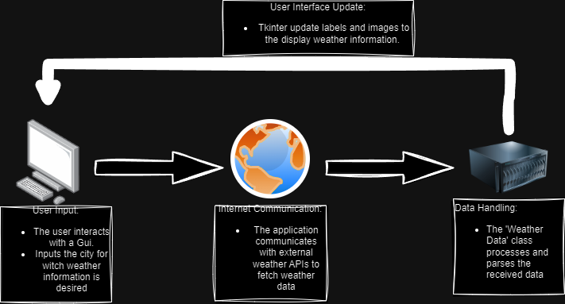
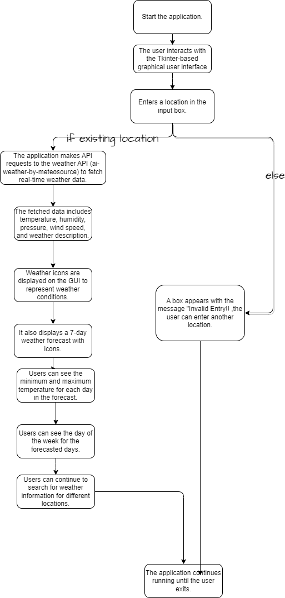

# Weather App README

This is a Weather App implemented in Python using the Tkinter library for the graphical user interface.
It provides weather information for a specified location, including temperature, humidity, pressure,
wind speed, and a weather description. Additionally, it displays a 7-day weather forecast with icons representing the
weather conditions.!

## Features
- **Weather Information:** The app retrieves real-time weather information, such as temperature, humidity, pressure,
wind speed, and weather description for a specified location.
- **7-Day Weather Forecast:** It displays a 7-day weather forecast with icons indicating the weather conditions for each
day.
- **Timezone and Clock:** The app displays the current local time and timezone for the selected location.
## Architecture Diagram


## Process Flow Diagram



## Installation
Clone this repository to your local machine:
``` 
* git clone https://github.com/FaurCristian/WeatherAppFinalProject.git

Install the required Python packages:

Copy code:
pip install poetry
poetry install

After installation, it is necessary to enter your own API key in the `weather_app_gui.py` file,
which can be obtained from https://rapidapi.com/MeteosourceWeather/api/ai-weather-by-meteosource.
The places where the API key needs to be entered are on lines of code 308 and 320.

Usage:
Run the Weather App by executing the following command:
poetry run python src\main.py


The app's graphical user interface will open, allowing you to enter the name of the location for which you want to check
the weather.

Click the "Search" button, and the app will display real-time weather information and a 7-day weather forecast for the
specified location.

You can also see the local time and timezone information for the selected location.

Extra:

●Upon running, a CSV file should be created, containing the data; 
●A PNG file should be created, containing the visualization of the previously mentioned data


Contributing
If you'd like to contribute to this project, feel free to open an issue or create a pull request with your changes.
Contributions are welcome!

License
This Weather App is open-source and available under the MIT License. You are free to use, modify, and distribute this
software as long as you include the original license in your distribution.

This README provides an overview of the Weather App and instructions for installation and usage. Feel free to customize 
it for your project as needed.\
